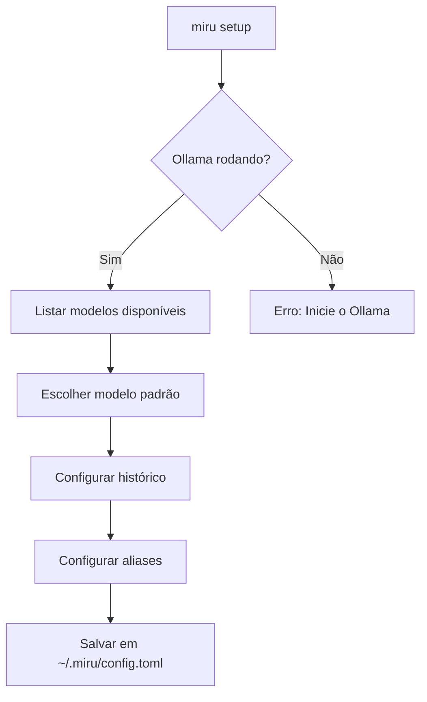
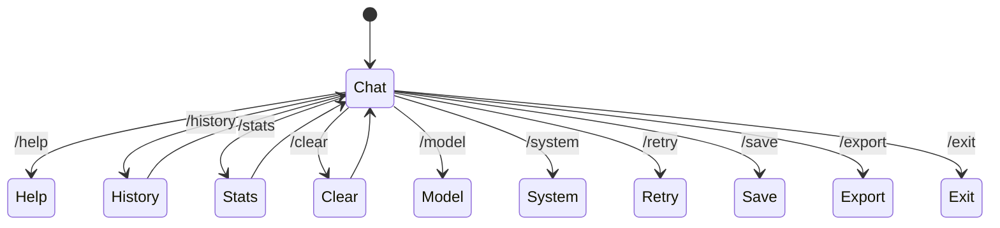
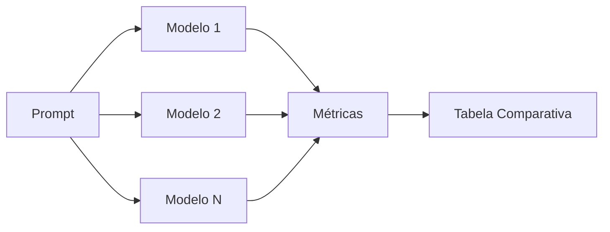
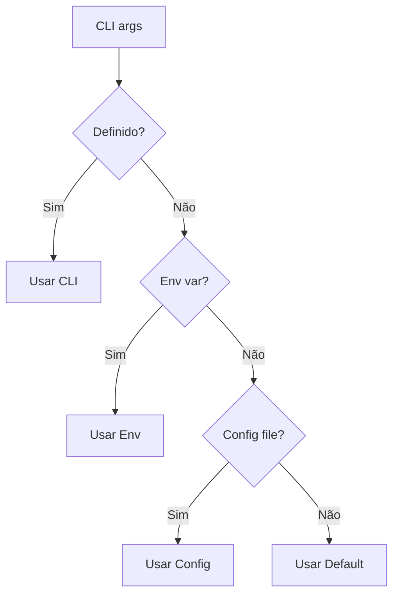
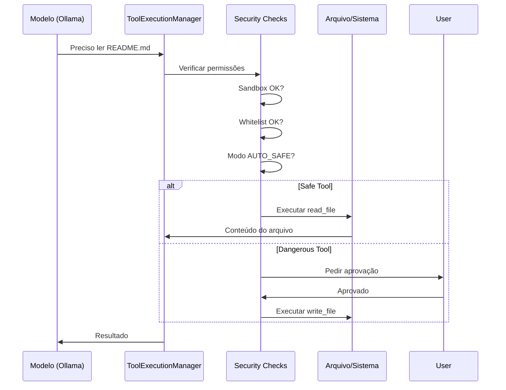

# Tutorial do Miru

Bem-vindo ao tutorial do **miru**, uma CLI Python para o servidor Ollama local. Este guia vai te ajudar a começar do zero e dominar as principais funcionalidades.

## O que é o Miru?

**Miru** (見る) significa "ver" ou "olhar" em japonês. É uma interface de linha de comando para interagir com modelos de IA locais via Ollama, com suporte a:

- **Multimodalidade**: Imagens, arquivos e áudio
- **Function Calling**: Ferramentas que o modelo pode executar
- **Benchmarking**: Comparação entre modelos
- **Chat Interativo**: Sessões com histórico
- **Templates**: Prompts reutilizáveis

## Instalação e Configuração

### Pré-requisitos

1. **Python 3.10+** instalado
2. **Ollama** rodando localmente ([instalar Ollama](https://ollama.ai))

```bash
# Verificar se Ollama está rodando
curl http://localhost:11434/api/tags

# Instalar miru
pip install miru
```

### Setup Inicial

O comando `miru setup` guia você pela configuração inicial:

```bash
miru setup
```



## Comandos Básicos

### Listar e Gerenciar Modelos

```bash
# Listar modelos instalados
miru list

# Ver modelos carregados na memória (VRAM)
miru ps

# Informações de um modelo
miru info gemma3:latest

# Baixar novo modelo
miru pull llama3.2:latest

# Deletar modelo
miru delete modelo:tag
```

### Executar Prompt Único

```bash
# Prompt simples
miru run gemma3:latest "O que é recursão?"

# Com imagem (modelo multimodal)
miru run llava:latest "Descreva esta imagem" --image foto.jpg

# Com arquivo
miru run gemma3:latest "Resuma" --file relatorio.pdf

# Com áudio
miru run gemma3:latest "Transcreva" --audio reuniao.mp3
```

## Chat Interativo

### Iniciando uma Sessão

```bash
# Iniciar chat
miru chat gemma3:latest

# Com system prompt (comportamento definido)
miru chat gemma3:latest --system "Você é um especialista em Python. Seja conciso."

# Com imagem
miru chat llava:latest --image diagrama.png
```

### Comandos do Chat

Dentro do chat, use estes comandos:



| Comando | Descrição |
|---------|-----------|
| `/help` | Lista todos os comandos |
| `/exit` | Encerra a sessão |
| `/clear` | Limpa o histórico |
| `/history` | Mostra contagem de turnos |
| `/stats` | Estatísticas da sessão |
| `/model <nome>` | Troca de modelo |
| `/system <prompt>` | Altera o system prompt |
| `/recall [n]` | Resgata prompt anterior |
| `/retry` | Re-executa último prompt |
| `/save <nome>` | Salva sessão |
| `/export <fmt>` | Exporta (json/md/txt) |

#### Resgatando Prompts Anteriores

O comando `/recall` permite reutilizar prompts de sessões anteriores:

```bash
# Modo interativo
>>> /recall

Previous Prompts
  [0] 2026-04-07 09:30 - Qual é o verso bíblico mais conhecido?
  [1] 2026-04-07 09:25 - Explique closures em Python
  [2] 2026-04-07 09:20 - Como funciona async/await?

Select prompt to recall (0-2) or press Enter to cancel
>>> 1

# Modo direto
>>> /recall 2
Prompt loaded from 2026-04-07 09:20
>>> Como funciona async/await?
```

O prompt carregado mantém o model e system_prompt da sessão atual, apenas substituindo o texto do prompt.

## Multimodalidade

### Imagens

```bash
# Uma imagem
miru run llava:latest "Descreva" --image foto.png

# Múltiplas imagens
miru run gemma3:latest "Compare" --image img1.jpg --image img2.jpg
```

Modelos com visão: `llava`, `moondream`, `gemma3`

### Arquivos

```bash
# Analisar código
miru run gemma3:latest "Explique" --file main.py

# Múltiplos arquivos
miru run gemma3:latest "Compare" --file a.py --file b.py
```

Formatos suportados: `.txt`, `.md`, `.py`, `.js`, `.ts`, `.json`, `.yaml`, `.xml`, `.html`, `.pdf`, `.docx`

### Áudio

```bash
# Transcrição
miru run gemma3:latest "Resuma a reunião" --audio reuniao.mp3
```

Requer: `pip install openai-whisper`

## Templates

### Criar e Usar Templates

```bash
# Criar template
miru template save code-review \
  --prompt "Revise este código: {code}" \
  --description "Template para revisão de código"

# Usar template
miru template run code-review gemma3:latest \
  --param code="def hello(): pass"

# Ver templates disponíveis
miru template list
```

### Exportar e Importar

```bash
# Exportar
miru template export code-review --output template.json

# Importar
miru template import template.json --name revisao
```

## Comparação de Modelos (Benchmark)

### Comparação Básica

```bash
# Comparar dois modelos
miru compare gemma3 qwen2.5:7b --prompt "Explique closures"

# Com sistema para consistência
miru compare gemma3 qwen2.5:7b \
  --prompt "O que é closure?" \
  --system "Responda em português, máximo 2 parágrafos"

# Com seed para reprodutibilidade
miru compare gemma3 qwen2.5:7b --prompt "Teste" --seed 42
```

### Comparação Multimodal

```bash
miru compare llava moondream \
  --prompt "Descreva a imagem" \
  --image diagrama.png
```



## Processamento em Lote

```bash
# Arquivo de prompts (um por linha)
cat > prompts.txt << EOF
O que é Python?
O que é JavaScript?
O que é Rust?
EOF

miru batch gemma3:latest --prompts prompts.txt

# JSONL com metadados
cat > data.jsonl << EOF
{"prompt": "Traduza: hello", "id": 1}
{"prompt": "Traduza: world", "id": 2}
EOF

miru batch gemma3:latest --prompts data.jsonl --format json

# Com system prompt
miru batch gemma3 --prompts prompts.txt --system "Seja conciso"

# Output JSON
miru batch gemma3 --prompts prompts.txt --format json > results.json
```

## Embeddings

Embeddings são vetores numéricos que representam texto semanticamente.

```bash
# Embedding de texto
miru embed nomic-embed-text "Hello world"

# Embedding de arquivo
miru embed nomic-embed-text --file documento.txt

# Lote (um texto por linha)
miru embed nomic-embed-text --batch textos.txt --format jsonl

# Formato JSON
miru embed nomic-embed-text "Teste" --format json

# Minimalista (apenas array)
miru embed nomic-embed-text "Teste" --quiet
```

## Configuração

### Arquivo de Configuração

Localização: `~/.miru/config.toml`

```bash
# Ver configuração
miru config list

# Definir valores
miru config set default_model gemma3:latest
miru config set default_temperature 0.7
miru config set history_max_entries 500

# Obter valor
miru config get default_model

# Resetar
miru config reset --force
```

### Profiles

Configure diferentes ambientes:

```bash
# Criar profile
miru config profile create work

# Alternar
miru config profile switch work

# Listar
miru config profile list

# Deletar
miru config profile delete work
```

### Precedência de Configuração



1. **Argumentos CLI** (maior prioridade)
2. **Variáveis de ambiente**
3. **Arquivo de configuração**
4. **Valores padrão**

### Variáveis de Ambiente

```bash
export OLLAMA_HOST="http://localhost:11434"
export MIRU_DEFAULT_MODEL="gemma3:latest"
export MIRU_DEFAULT_HOST="http://localhost:11434"
export MIRU_HISTORY_ENABLED="true"
export MIRU_VERBOSE="false"
```

## Histórico

O miru mantém um histórico completo de todos os prompts executados:

```bash
# Ver histórico
miru history

# Limitar entradas
miru history --limit 50

# Filtrar por comando
miru history --command run

# Buscar
miru history --search "python"

# Formato JSON
miru history --format json

# Limpar
miru history --clear

# Ver detalhes
miru history show 0
```

### Detalhes de uma Entrada

```bash
miru history show 0

Data/Hora: 2026-04-07T09:33:38
Comando: chat
Modelo: gemma3:latest
Status: ✓ Sucesso

Prompt:
Qual é o verso bíblico mais conhecido?

Resposta:
                           Resposta com Markdown                           

Aqui está uma explicação:

Código de Exemplo

                                                                                
 def hello():                                                                  
     print('Hello World')                                                      
                                                                                

Métricas:
  Tokens: 150
```

As respostas em `miru history show` são renderizadas com formatação Markdown completa (headers, código, tabelas, listas), proporcionando a mesma experiência visual do chat e run em tempo real.

## Aliases

Atalhos para modelos frequentes:

```bash
# Criar
miru alias add g3 gemma3:latest
miru alias add qwen qwen2.5:7b

# Listar
miru alias list

# Usar (em qualquer comando)
miru run g3 "Hello"
miru chat qwen

# Deletar
miru alias delete g3 --force
```

## Quick Commands

Comandos pré-configurados para tarefas comuns:

```bash
# Gerar código
miru quick code gemma3 --param language=python --param task="sort list"

# Resumir texto
miru quick summarize gemma3 --param text="Long text..."

# Explicar tópico
miru quick explain gemma3 --param topic="machine learning"

# Traduzir
miru quick translate-pt gemma3 --param text="Hello world"
miru quick translate-en gemma3 --param text="Olá mundo"

# Revisar código
miru quick review-code gemma3 --param language=python --param code="$(cat main.py)"

# Gerar testes
miru quick test gemma3 --param language=python --param code="$(cat main.py)"

# Refatorar
miru quick refactor gemma3 --param language=python --param code="$(cat main.py)"

# Documentar
miru quick document gemma3 --param language=python --param code="$(cat main.py)"

# Listar todos
miru quick --list
```

## Tools / Function Calling

O miru suporta function calling nativo do Ollama, permitindo que modelos executem ações no sistema de forma segura.

### Arquitetura de Segurança



### Modos de Execução

| Modo | Descrição |
|------|-----------|
| `DISABLED` | Tools desabilitadas |
| `MANUAL` | Aprovação para cada tool |
| `AUTO` | Executa tudo automaticamente |
| `AUTO_SAFE` | Auto para safe, aprovação para dangerous |

### Tools Disponíveis

#### File Tools

| Tool | Ação | Nível |
|------|------|-------|
| `read_file` | Lê arquivo | Safe |
| `write_file` | Escreve arquivo | Dangerous |
| `edit_file` | Edita arquivo | Dangerous |
| `list_files` | Lista arquivos | Safe |
| `search_files` | Busca arquivos | Safe |
| `delete_file` | Deleta arquivo | Dangerous |
| `file_exists` | Verifica existência | Safe |
| `get_file_info` | Metadados | Safe |

#### System Tools

| Tool | Ação | Nível |
|------|------|-------|
| `run_command` | Executa comando | Dangerous |
| `get_env` | Lê variável de ambiente | Safe |
| `get_current_dir` | Diretório atual | Safe |

### Uso Programático

```python
from pathlib import Path
from miru.ollama.client import OllamaClient
from miru.tools import ToolExecutionManager, ToolExecutionMode

manager = ToolExecutionManager(
    mode=ToolExecutionMode.AUTO_SAFE,
    sandbox_dir=Path("./workspace"),
    allow_write=True,
    allow_delete=False,
)

# Executar tool
result, error = manager.execute_tool(
    "read_file",
    {"path": "README.md"}
)
print(result)
```

### Sandbox de Arquivos

Isola operações de arquivo a um diretório específico:

```python
from miru.tools import FileSandbox
from pathlib import Path

sandbox = FileSandbox(
    root=Path("./workspace"),
    allow_write=True,
    allow_delete=False,
    allowed_extensions=[".txt", ".md", ".py"],
)

# Path traversal é bloqueado
sandbox.resolve_path("test.txt")  # OK: ./workspace/test.txt
sandbox.resolve_path("../../../etc/passwd")  # ERRO: SecurityError
```

## Sessões

### Salvar e Restaurar

```bash
# No chat interativo
>>> /save minha-sessao

# Listar sessões salvas
miru session list

# Exportar sessão
miru session export minha-sessao --output sessao.json
miru session export minha-sessao --output sessao.md --format markdown

# Deletar
miru session delete minha-sessao --force
```

## Logs e Debugging

```bash
# Ver logs
miru logs

# Últimas N linhas
miru logs --lines 100

# Seguir em tempo real
miru logs --follow

# Apenas o mais recente
miru logs --latest

# Listar arquivos de log
miru logs --list

# Limpar
miru logs clear --force
```

## Shell Completion

### Bash

```bash
miru completion bash > ~/.local/share/bash-completion/completions/miru
source ~/.local/share/bash-completion/completions/miru
```

### Zsh

```bash
miru completion zsh > ~/.zsh/completions/_miru
# Adicione ao .zshrc:
fpath+=~/.zsh/completions
autoload -U compinit && compinit
```

### Fish

```bash
miru completion fish > ~/.config/fish/completions/miru.fish
```

## Parâmetros de Inferência

Controle fino da geração:

```bash
miru run <modelo> "prompt" \
  --temperature 0.7 \      # Criatividade (0.0-2.0)
  --top-p 0.9 \            # Nucleus sampling (0.0-1.0)
  --top-k 40 \             # Top-k sampling
  --max-tokens 500 \       # Limite de tokens
  --seed 42 \              # Reprodutibilidade
  --repeat-penalty 1.1 \   # Evitar repetição
  --ctx 4096               # Janela de contexto
```

### Exemplo de Uso

```bash
# Geração criativa (alta temperatura)
miru run gemma3:latest "Conte uma história" \
  --temperature 1.2 \
  --max-tokens 1000

# Geração determinística (seed fixo)
miru run gemma3:latest "Explique Python" \
  --temperature 0.3 \
  --seed 42
```

## Fluxo de Trabalho Completo

```mermaid
flowchart TB
    subgraph Setup
        A1[Install miru] --> A2[miru setup]
        A2 --> A3[Choose default model]
    end

    subgraph Daily Use
        B1[Chat interativo] --> B2[Salva sessão]
        B3[Quick commands] --> B4[Templates]
    end

    subgraph Development
        C1[Code review] --> C2[Generate tests]
        C2 --> C3[Refactor]
    end

    subgraph Analysis
        D1[Compare models] --> D2[Benchmark]
        D2 --> D3[Choose best]
    end

    Setup --> Daily Use
    Daily Use --> Development
    Development --> Analysis
```

## Dicas e Boas Práticas

### Escolha de Modelos

| Tarefa | Modelo Recomendado |
|--------|-------------------|
| **Chat geral** | gemma3:latest, qwen2.5:7b |
| **Código** | codellama, deepseek-coder |
| **Visão** | llava:latest, moondream |
| **Embeddings** | nomic-embed-text |
| **Rápido/Leve** | gemma3:1b, phi3:mini |

### System Prompts Úteis

```bash
# Expert técnico
miru chat gemma3 --system "Você é um especialista. Responda com precisão técnica, incluindo código quando relevante."

# Tutor paciente
miru chat gemma3 --system "Você é um tutor paciente. Explique passo a passo com exemplos simples."

# Revisor rigoroso
miru chat gemma3 --system "Você é um revisor de código rigoroso. Aponte problemas de segurança, performance e legibilidade."

# Tradutor
miru chat gemma3 --system "Traduza para português brasileiro, mantendo o tom e estilo do original."
```

### Automação com Scripts

```bash
#!/bin/bash
# review.sh - Revisa todos os arquivos Python

for file in *.py; do
    echo "=== Reviewing $file ==="
    miru run gemma3 "Revise este código" --file "$file" --quiet
done
```

```bash
#!/bin/bash
# translate.sh - Traduz arquivo

miru run gemma3 "Traduza para português mantendo formatação" \
  --file documento.txt \
  --system "Tradutor profissional" \
  --quiet > documento_pt.txt
```

## Solução de Problemas

### Ollama não encontrado

```bash
# Verificar se está rodando
curl http://localhost:11434/api/tags

# Iniciar serviço
ollama serve
```

### Modelo não encontrado

```bash
# Baixar modelo
miru pull gemma3:latest

# Ou usar auto-pull
miru run gemma3 "Hello" --auto-pull
```

### Erro de memória

```bash
# Verificar modelos na VRAM
miru ps

# Descarregar modelo
miru stop modelo:tag --force
```

### Logs para debug

```bash
# Ver logs
miru logs --latest

# Modo verbose
miru run gemma3 "Test" --verbose
```

## Próximos Passos

1. Execute `miru setup` para configuração inicial
2. Explore `miru examples --list` para exemplos práticos
3. Teste `miru chat` com diferentes modelos
4. Crie templates para prompts frequentes
5. Configure aliases para modelos que você mais usa

## Recursos Adicionais

- **README.md**: Documentação completa de referência
- **CHANGELOG.md**: Histórico de mudanças
- **GitHub**: https://github.com/walternagai/miru

---

**Licença**: Apache License 2.0